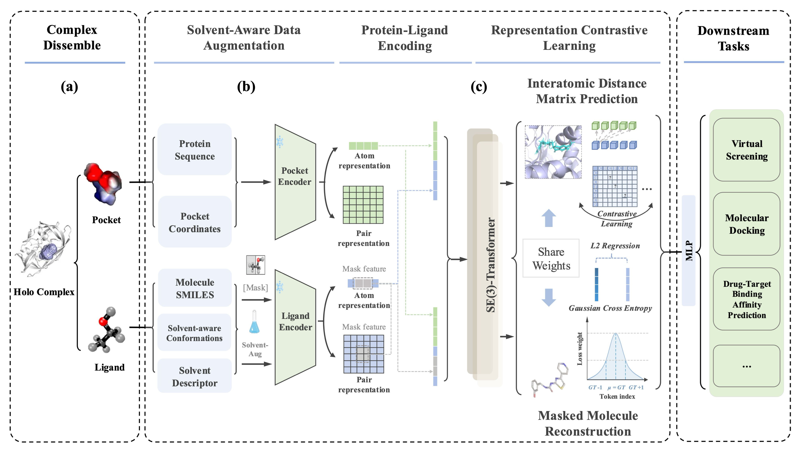

# Contrastive Multi-Task Learning with Solvent-Aware Augmentation for Drug Discovery

This repository provides the official PyTorch implementation of our **solvent-aware pre-training framework** for structure-based drug discovery.  
The method combines (i) conformational ensembles in diverse solvent environments, (ii) contrastive multi-task learning, and (iii) geometry-enhanced self-supervision to deliver robust, accurate, and generalizable protein–ligand representations.

<p align="center"></p>
<p align="center"><b>Overview of pre-training framework</b></p>


Dependencies
------------
 - [Uni-Core](https://github.com/dptech-corp/Uni-Core), check its [Installation Documentation](https://github.com/dptech-corp/Uni-Core#installation).
 - rdkit==2022.9.3, install via `pip install rdkit-pypi==2022.9.3`

> **Note**  
> We recommend running the code inside the official Uni-Core Docker image to avoid CUDA / PyTorch version conflicts.

Pull the docker image and install rdkit inside:

```bash
docker pull dptechnology/unicore:latest-pytorch2.1.0-cuda12.1-rdma
```

Training
------------
### Configuration

Set the required environment variables or edit the paths in `train.sh` to point to your dataset and log directories.


### Start training

Use the provided training script:

```bash
bash train.sh
```

Data and Scripts
------------

| Data                     | File Size  | Update Date | Download Link                                                                                                             | 
|--------------------------|------------| ----------- |---------------------------------------------------------------------------------------------------------------------------|
| protein-ligand interactions | - | - |https://zhanggroup.org/BioLiP/weekly.html
| protein-ligand binding   | 263.27MB   | Sep 8  2022 |https://bioos-hermite-beijing.tos-cn-beijing.volces.com/unimol_data/finetune/protein_ligand_binding_pose_prediction.tar.gz |
| molecular conformation in solvents   | 22.81GB   | Dec 10  2024 |https://www.research-collection.ethz.ch/handle/20.500.11850/710355 |

`davis/full.csv` `kiba/full.csv` - tables with the protein-ligand pairs and corresponding affinity values (labels).

### Data Preparation
Download the required datasets and place them in the corresponding sub-folders under `data_preparation/`.

After arranging the files, run:
```bash
python data_preparation.py
```


We use [LMDB](https://lmdb.readthedocs.io) to store data, you can use the following code snippets to read from the LMDB file.

```python
import lmdb
import numpy as np
import os
import pickle

def read_lmdb(lmdb_path):
    env = lmdb.open(
        lmdb_path,
        subdir=False,
        readonly=True,
        lock=False,
        readahead=False,
        meminit=False,
        max_readers=256,
    )
    txn = env.begin()
    keys = list(txn.cursor().iternext(values=False))
    for idx in keys:
        datapoint_pickled = txn.get(idx)
        data = pickle.loads(datapoint_pickled)
```
We use pickle protocol 5, so Python >= 3.8 is recommended.

